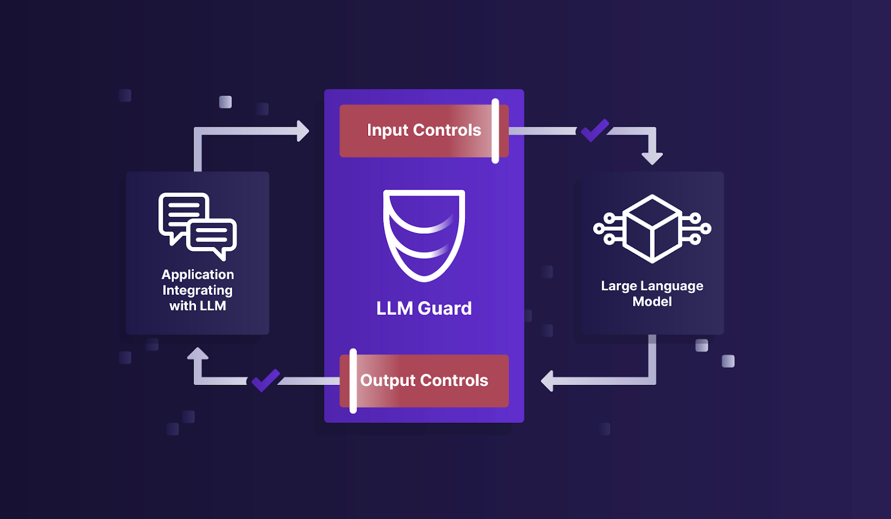

# Inference-Escort - The Security Toolkit for LLM Interactions

Inference-Escort is a comprehensive tool designed to fortify the security of Large Language Models (LLMs).

[**Changelog**](./changelog.md)

## What is Inference-Escort?



By offering sanitization, detection of harmful language, prevention of data leakage, and resistance against prompt
injection attacks, Inference-Escort ensures that your interactions with LLMs remain safe and secure.

## Installation

Begin your journey with Inference-Escort by downloading the package:

```sh
pip install inference-escort
```

## Getting Started

**Important Notes**:

- Inference-Escort is designed for easy integration and deployment in production environments. While it's ready to use
  out-of-the-box, please be informed that we're constantly improving and updating the repository.
- Base functionality requires a limited number of libraries. As you explore more advanced features, necessary libraries
  will be automatically installed.
- Ensure you're using Python version 3.9 or higher. Confirm with: `python --version`.
- Library installation issues? Consider upgrading pip: `python -m pip install --upgrade pip`.

**Examples**:

- Get started with [ChatGPT and Inference-Escort](https://github.com/callme110/Inference-Escort/blob/main/examples/openai_api.py).

## Project Docs

- Read our
  [docs](https://callme110.github.io/Inference-Escort/)
  for more info about how to use and customize Inference-Escort, and for step-by-step tutorials.
- Post a [Github
  Issue](https://github.com/callme110/Inference-Escort/issues) to submit a bug report, feature request, or suggest an improvement.
